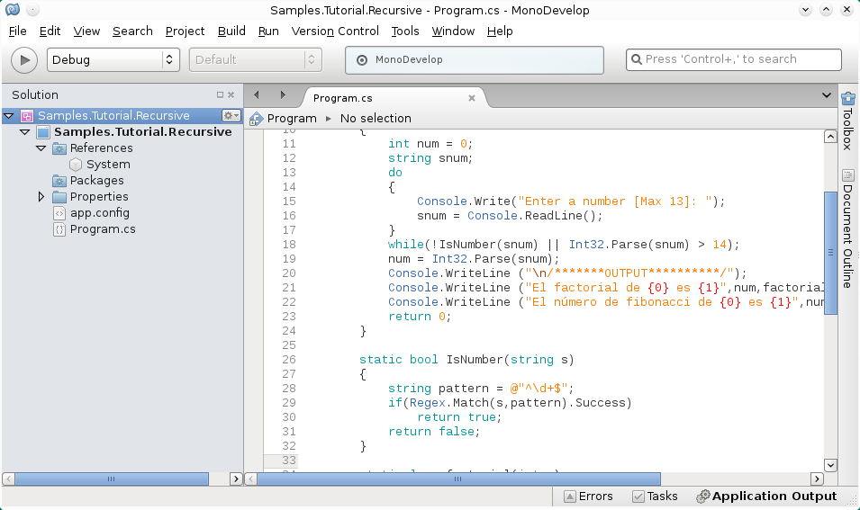
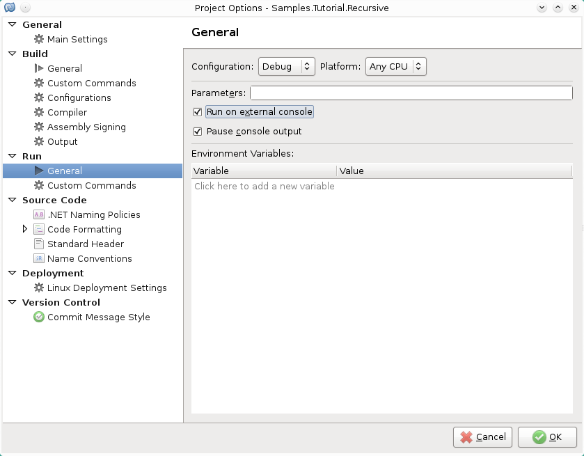
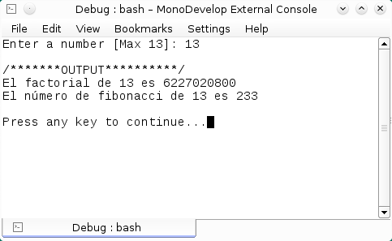

# Notas acerca de la recursión en C#
		

La recursión es una técnica de programación que se programa mediante un método que ya sea por  iteración  o  por  decisión  resuelve  un  problema  hasta  llegar  a  un  caso base
			,  un  método recursivo  es  un  método  que  se  llama  así  mismo  ya  sea  directamente  o  indirectamente  a través  de  otro  método.  Los  enfoques  recursivos  para resolver  problemas  tienen  varios elementos  en  común.  El  método  en  si  sabe  como  resolver  el  o  los  casos  más sencillos  los llamados casos base.  

			
Como un ejemplo ilustrativo, escribí un sencillo programa que contiene las funciones Fibonacci y factorial.

			

 
			
El programa se escribió en un proyecto Xamarin

			
<b>Fig 1. El programa en el entorno de Xamarin</b>
 
			

 
			
Para ejecutar el programa desde una consola de terminal, habilitar en el proyecto la opción <b>"Run on external console"</b>

			
<b>Fig 2. Habilitando la opción "Run on external console"</b>
 
			

 
			
<b>Fig 3. El programa en ejecucción</b>
 
			

